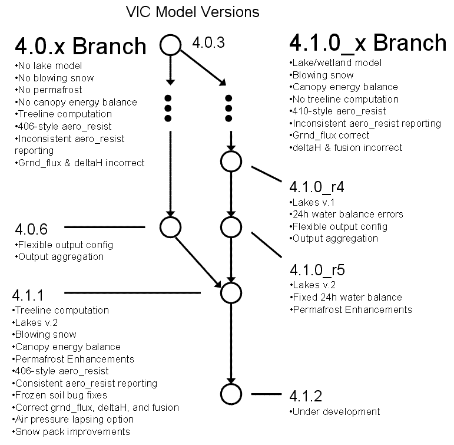

# Overview of VIC Version 4 Development

VIC development branched into 2 parallel paths at release 4.0.3. The 4.0.x branch has continued development of the same basic feature set, while the 4.1.x branch has incorporated new model algorithms including spatially-distributed soil ice and snow cover, a lake model, and permafrost processes.

**VIC Releases 4.0.0 - 4.0.6 all contain the same basic feature set:**

*   Multiple land cover tiles per grid cell
*   Single soil column per grid cell, consisting of multiple soil layers
*   Water balance and energy balance modes
*   Optional finite-difference solution to soil temperature profile
*   Modeling of both the surface snow pack and the snow intercepted by the canopy
*   Simulation of seasonally-frozen soil
*   Multiple snow/elevation bands within a grid cell

**VIC Releases 4.1.0 and 4.1.1 contain several new features, including:**

*   Canopy temperature no longer assumed to equal air temperature; temperature of canopy snow found by iterating to close the canopy energy balance.
*   Optional iteration between the canopy energy solution and the surface energy solution. This behavior is controlled by the CLOSE_ENERGY parameter.
*   Parameterization of spatial variability of snow cover and frozen soil
*   Simulation of effects of snowmelt for partial snow cover
*   Modeling of lakes and wetlands
*   Modeling of blowing snow sublimation
*   Modeling of permafrost

Figure: Schematic of recent VIC versions and their features.

**VIC Version 4.1.1 is the successor to both 4.0.6 and 4.1.0.**

*   Unfortunately, VIC versions 4.0.6 and 4.1.0 are not compatible
*   Some of Version 4.1.0's new features broke older features, for example 24-hour water balance mode
*   Version 4.1.1 has the "best" of both versions
*   Results from versions 4.0.6 and 4.1.0 can (mostly) be reproduced with version 4.1.1
*   Version 4.1.1 offers further improvements:
    *   6 kinds of potential evapotranspiration
    *   Improved lake/wetland model (lake parameters have changed)

* * *

### VIC 4.1.0 Beta 5 (22-Jun-2008)

New Features:

*   Updated lake model
    *   Lake drainage is now parameterized as flow over a broad-crested weir
    *   2-layer snow pack model for snow on top of lake ice, consistent with upland snow pack model
    *   New format for lake parameter file, as a result of new drainage parameterization
*   Option to use improved snow density algorithm, taken from SNTHERM89
*   Option to use snow albedo decay algorithm of Sun et al. 1999

Bugs Fixed:

*   The code can now handle very shallow lakes without crashing
*   Correct soil ice fractions for the case when FROZEN_SOIL = TRUE and options.SNOW_BAND > 1
*   Fixed incorrect setting of NOFLUX in calc_surf_energy_bal()
*   24h water balance mode results have been reconciled with those of 4.0.6

Known Issues:

*   Water balance errors for DIST_PRCP = TRUE

### VIC 4.1.0 Beta 4 (23-Oct-2007)

New Features:

*   Flexible output configured via the global control file
*   Optional headers for input and output files
*   Optional aggregation to daily timestep of output variables
*   Optional ALMA compliant input and output
*   Sample global parameter file included with source code, including examples of flexible output configuration
*   STATEFILE option is now specified in global control file, not the user_def.h
*   State files are now saved at the end of the final timestep of the state file save date
*   ARNO_PARAMS global option is now BASEFLOW, with the following behavior:
    *   When BASEFLOW is ARNO, the standard baseflow parameters are read from the soil file
    *   When BASEFLOW is NIJSSEN2001, the baseflow parameters from Nijssen et al (2001) are read from the soil file
*   LAKE_MODEL compile-time option (in user_def.h) has been removed
*   CONTINUEONERROR option (in global parameter file) allows model to continue simulating other grid cells in domain after encountering an error
*   Permafrost-related features, including:
    *   Optional exponential distribution of soil thermal nodes
    *   Implicit solution of soil temperature profile
    *   Simulation of loss of ground ice via EXCESS_ICE option

Bugs Fixed:

*   Fixes to water balance errors in lake model
*   Fixed water balance errors arising in 24-hour water balance mode
*   Fixed errors in baseflow calculation

Known Issues:

*   QUICK_FS option does not work

### VIC 4.1.0 Beta 3 (13-Sep-2006)

New Features:

*   Improved lake model, including:
    *   More flexible default lake profile, ranging from parabolic to square
    *   Computation of blowing snow sublimation over lakes
*   Support for ALMA input and output variables:
    *   Automatically understands ALMA input variables: PSURF, QAIR, TAIR, RAINF, SNOWF in addition to standard VIC input variables
    *   New ALMA_OUTPUT global parameter file option; when TRUE, VIC writes output variables conforming to the ALMA convention
*   New stand-alone program vicInterp
    *   Reads daily forcings (PREC, TMAX, TMIN, WIND) and outputs sub-daily forcings
    *   Essentially a stripped-down version of VIC (compiled with the OUTPUT_FORCE option)
    *   vicInterp can be compiled simply by typing `make interp` in the vic source code directory

Bugs Fixed:

*   Fix large water balance errors in daily water balance mode when snow is present
*   Lake model crashes when lakes dry up and when large (>97% of grid cell) lakes fill up
*   Lake model state not saved in state files
*   Aerodynamic resistance written to output files is not the actual aerodynamic resistance used in flux computations
*   Global parameter "ARNO_PARAMS" renamed to "NIJSSEN2001_BASEFLOW" to reflect its true meaning
    *   Users should replace "ARNO_PARAMS" with "NIJSSEN2001_BASEFLOW" in their global parameter files
    *   VIC will still accept ARNO_PARAMS for now, but it will be phased out in the next release

### VIC 4.1.0 Beta 2 (18-Oct-2004)

This release contains several modifications compared to 4.1.0 Beta 1, including many of the fixes added to 4.0.5.

New Features:

*   `-v` and `-o` command-line options, for displaying your VIC version and values of compile-time options
*   Automatic recompilation on updates to \*.h
*   NEW_ARNO_TYPE global option is now ARNO_PARAMS. NOTE: When ARNO_PARAMS is TRUE, baseflow parameters from Nijssen et al (2001) are read from the soil file. When ARNO_PARAMS is FALSE, standard baseflow parameters are read from the soil file. We apologize for this confusing behavior; this will be fixed in the final release of VIC 4.1.0.

Bugs Fixed:

*   Spurious condensation at low temperatures
*   Validation of initial soil moisture
*   Incorrect baseflow limits
*   Runs using initial state files starting at state file date rather than global start date
*   Incorrect sublimation values for BLOWING option
*   Negative incoming shortwave radiation at high latitudes
*   Undefined daily precipitation for deserts
*   Snow_flux incorrectly set to Tcanopy in fluxes output file
*   Incorrect value for sub_snow in fluxes output file

Known Issues:

*   Lake model crashes when lakes dry up and when large (>97% of grid cell) lakes fill up
*   Lake model does not function properly with multiple snowbands per cell
*   Lake model must be run at sub-daily timestep; daily water balance runs cannot run lake model
*   Lake model state not saved in state files
*   Large water balance errors in daily water balance mode when snow is present
*   COMPUTE_TREELINE option does not function
*   Aerodynamic resistance written to output files is not the actual aerodynamic resistance used in flux computations

### VIC 4.1.0 Beta 1 (30-Jul-2003)

Original implementation of the 4.1.x branch.

Known Issues:

*   Lake model does not function properly with multiple snowbands per cell
*   Lake model crashes when lakes dry up and when large (>97% of grid cell) lakes fill up
*   Lake model must be run at sub-daily timestep; daily water balance runs cannot run lake model
*   Lake model state not saved in state files
*   COMPUTE_TREELINE option does not function
*   Large water balance errors in daily water balance mode when snow is present
*   Aerodynamic resistance written to output files is not the actual aerodynamic resistance used in flux computations
*   Spurious condensation at low temperatures
*   Incorrect baseflow limits
*   Incorrect sublimation values for BLOWING option
*   Negative incoming shortwave radiation at high latitudes
*   Undefined daily precipitation for deserts
*   Snow_flux incorrectly set to Tcanopy in fluxes output file
*   Incorrect value for sub_snow in fluxes output file

### VIC 4.0.6 (19-Jan-2008)

New Features:

*   Flexible output configured via the global control file
*   Optional headers for input and output files
*   Optional aggregation to daily timestep of output variables
*   Optional ALMA compliant input and output
*   Sample global parameter file included with source code, including examples of flexible output configuration
*   STATEFILE option is now specified in global control file, not the user_def.h
*   State files are now saved at the _END_ of the final timestep of the state file save date
*   0-area snow/elevation bands now omitted from state files
*   ARNO_PARAMS global option is now BASEFLOW, with the following behavior:
    *   When BASEFLOW is ARNO, the standard baseflow parameters are read from the soil file
    *   When BASEFLOW is NIJSSEN2001, the baseflow parameters from Nijssen et al (2001) are read from the soil file
*   Improved validation of global parameter file options to prevent bad parameter choices

Bugs Fixed:

*   Fixed incorrect reporting of aerodynamic resistance in output files (stability correction had been neglected)
*   Fixed failure to skip over deactivated grid cells when reading state files
*   Fixed incorrect reading/writing of state files when QUICK_FLUX is TRUE
*   Fixed incorrect output file open/close for OUTPUT_FORCE option
*   Fixed incorrect interpolation of sub-daily air temperature when referencing GMT instead of local time
*   Fixed various memory errors and leaks
*   Fixed bugs in baseflow calculations related to previous baseflow bug fixes

Known Issues:

*   On some systems, source files do not automatically recompile when .h files are modified

### VIC 4.0.5 (8-Oct-2004)

New Features:

*   `-o` command-line option for displaying values of compile-time options
*   Automatic recompilation on updates to \*.h
*   Optional July average temperature field in soil parameter file (for use with COMPUTE_TREELINE option)

Bugs Fixed:

*   Spurious condensation at low temperatures
*   Validation of initial soil moisture
*   Incorrect baseflow limits
*   Runs using initial state files starting at state file date rather than global start date
*   Negative incoming shortwave radiation at high latitudes
*   Undefined daily precipitation for deserts

### VIC 4.0.4 (5-Dec-2003)

New Features:

*   `-v` command-line option for displaying your VIC version
*   Ability to use baseflow parameters from Nijssen et al (2001) in soil file, via ARNO_PARAMS global option. NOTE: When ARNO_PARAMS is TRUE, baseflow parameters from Nijssen et al (2001) are read from the soil file. When ARNO_PARAMS is FALSE, standard baseflow parameters are read from the soil file. We apologize for this confusing behavior; this will be fixed in the final release of VIC 4.1.0.
*   Ability to specify treeline, via COMPUTE_TREELINE global option (prevents formation of glaciers in some areas)
*   Different snow albedo curves for accumulation and melting
*   Ability to handle ASCII state files

Bugs Fixed:

*   Fixes to incorrect indexing during sub-model time step snow calculations
*   Incorrect reading/writing of state files

### VIC 4.0.3 (15-Aug-2000)

### VIC 4.0.1 (30-May-2000)

### VIC 4.0.0 (16-May-2000)

### VIC 3.2.1 (1999)

* * *

## Version Check

To check which release of VIC you are running:

VIC releases 4.0.4 and later (and all 4.1.x releases):

Type `vicNl -v`

VIC releases 4.0.3 and earlier, and VIC 4.1.0 Beta 1: You must use the version header file to check your routines:

1.  Run `grep Id *.c > ver_old.txt` in the directory with your current source code.
2.  Get the most recent [version header file](ftp://ftp.hydro.washington.edu/pub/HYDRO/models/VIC/Version_Info), if you did not download the entire source code package.
3.  Use `xemacs` file compare, `sdiff`, diff, or another file comparison package to compare the two header files for differences.
4.  Modified files can then either be directly substituted, or a compare can be run between the complete source files to identify the exact differences.
