# Notes on the Calculation of Ground Heat Flux

Prepared by Keith Aric Cherkauer

## I. Introduction

The Variable Infiltration Capacity (VIC) macroscale hydrologic model (Liang et al., 1994; Liang et al., 1996) simulates the energy and water balance of hundreds or thousands of grid cells that comprise continental scale river basins. In so doing, the VIC model makes use of various simplifications or parameterizations of complex physical equations. This allows the model to simulate water and energy fluxes over large areas quickly, while maintaining a physical basis for the predictions. As the model has evolved, these simplifications and parameterizations have been tested using field data from various sites representative of disparate hydroclimatic conditions (see e.g. Wood et al., 1998; Lohmann et al., 1998 a; b; Liang et al 1997; Cherkauer and Lettenmaier, 1999).

In a recent comment, Lohmann (2000; hereafter L00) suggested that the formulation of ground heat flux introduced by Liang et al. (1999; hereafter LWL99) is flawed in its derivation. VIC simulations including point applications at Rosemount, Minnesota (Cherkauer and Lettenmaier, 1999), simulations of the entire Mississippi River basin (Maurer et al, 1999), and comparisons of simulated and satellite observed surface temperatures (Rhoads, 1999) have shown no clear indiction of a problem with the ground heat flux. However, most previous applications have concentrated primarily on the components of the water balance, and less on the energy balance. To put this issue to rest, a detailed study of the LWL99 ground heat flux formulation was conducted. This study, reported here, includes comparisons with, an analytical solution to the heat flux equations, as well as an explicit finite difference solution scheme.

## II. Ground Heat Flux

The equation describing the conduction of heat through the soil is:

where _Cs_ is the volumetric heat capacity, _K_ is the thermal conductivity, _T_ is soil temperature, _t_ is time, and _z_ is depth. Ground heat flux is defined as:

Many different methods have been used to estimate the transport of heat through the soil column in land surface schemes designed for inclusion in coupled land-atmosphere models. These include analytical solutions for special cases, simplification of the equations (Liang et al., 1999; Deardorff, 1978), and finite difference numerical solutions (Flerchinger, 1989; Cherkauer and Lettenmaier, 1999). The analytical solution and finite difference methods are the most accurate, but analytical solutions are limited to cases where soil thermal properties (thermal conductivity and heat capacity) do not vary with time, and the finite difference method is computationally intensive. Therefore simplified formulations are the accepted normal in practice.

The VIC model, as applied in recent studies (including, e.g., the Maurer et al. (1999) application to the entire Mississippi River basin, and the Rhoads (1999) study of the Arkansas-Red River basin) uses a slightly modified version of the LWL99 formulation. When deriving equations 12 and 20 in LWL99, the damping depth, _dp_ is assumed to be the diurnal damping depth (the depth at which the daily change in soil temperature is 1/e times smaller than the daily change in soil surface temperature). While this is acceptable for the 48 hour comparisons made by LWL99 (Figure 2), it has important deficiencies for simulations over the full annual cycle, as suggested by L00\. When the LWL99 formulation was implemented in the VIC model, the damping depth was redefined as the depth at which the interannual change in soil temperature is negligible. This damping depth is assumed to equal _Dp_ from Figure 1 of LWL99, which is described in the paper as the depth at which the variation in soil temperature is negligible. The difference in ground heat flux estimates using the LWL99 formulation with diurnal and VIC model damping depths is explored in Section III.

In the past few years, the VIC model has been run with one of two ground heat flux formulations: the LWL99 formulation, and a finite difference method. The finite difference method was developed for use with the frozen soil algorithm described by Cherkauer and Lettenmaier (1999), because accurate prediction of soil frost effects requires more detailed information about the profile of energy fluxes and temperatures within the soil column than is provided by the simplified LWL99 formulation. Whereas the LWL99 formulation uses three soil temperatures (one at the soil surface, one near the surface, and one at the damping depth), the finite difference method uses a user-defined number of nodes distributed through the soil column, and solves explicitly for soil temperatures. This eliminates the exponential temperature profile assumed by the LWL99 formulation to describe soil temperatures between the near-surface temperature and the damping depth. The assumption of an exponential profile was one of the criticisms expressed by L00 (Section 2), so comparisons between ground heat fluxes generated by the finite difference method and the LWL99 formulation (see Section IV) should indicate whether that assumption is problematic.

Both methods (LWL99 formulation and finite difference) solve the heat flux equations by assuming a constant temperature lower boundary. This is a common assumption when solving the heat flux equations, but as mentioned by L00 it does mean that energy is not conserved through the soil column. The surface energy balance is iterated to find a soil surface temperature that minimizes the energy balance error. As is common in heat flux solutions using a constant temperature lower boundary, energy can be gained or lost across this boundary depending on the temperature gradient within the profile. It is assumed when solving for heat flux through the soil column, that this source/sink at the bottom of the soil column has minimal effect on surface fluxes and temperatures. In Section V  VIC simulations using the finite difference method with a constant temperature bottom boundary are compared with simulations using the finite difference method with a no-flux bottom boundary. These comparisons should indicate whether or not the model gains or loses significant thermal energy through the bottom boundary.

## III. Analytical Comparisons

LWL99 compared ground heat flux estimates using their parameterization with the results of an analytical solution to the heat flux equations. Their comparison period was 48 hours, so they applied a diurnal surface temperature forcing (and no longer-term forcing, e.g., annual temperature cycle):

Where Tbar is average temperature, A(0) is the amplitude of the diurnal temperature cycle, and the frequency is related to the damping depth and thermal conductivity as:

While this is adequate for diurnal cycle studies, VIC model simulations often are run over many years, so there is an annual temperature cycle superimposed on the diurnal temperature cycle. This is represented in the surface forcing by including a sinusoidal annual temperature forcing (a) to the diurnal forcing (d):

The analytical ground heat flux solution can be modified for the case of both annual and diurnal temperature cycles as follows:

Two scenarios were selected for the comparisons. The first used soil layer depths of D1 = 0.05 m, and D2 = 0.10 m, and a damping depth equal to the diurnal damping depth ( dp = 0.132 m ). These values are similar to those used by LWL99\. Figure 1) shows a full year of ground heat fluxes predicted by the analytical solution and the LWL99 formulation. The LWL99 formulation overestimates and lags behind the seasonal cycle predicted by the analytical solution.

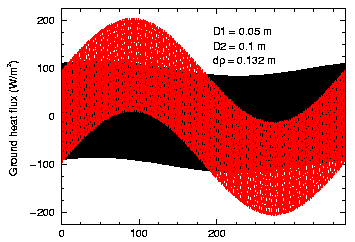  
**Figure 1:** Annual ground heat flux as estimated using the analytical solution (black) and LWL99 (red) using a damping depth of 0.132 m.

The second scenario uses depths of D1 = 0.10 m, D2 = 0.50 m, and dp = 4.0 m. These values are more like those used by the VIC model in the applications by Maurer et al. (1999), where the top two depths correspond to the top two soil moisture layers, and the damping depth is set to a depth at which soil temperature change is negligible. Figure 2) compares the estimated ground heat flux. With the damping depth set to a more realistic depth for representing annual temperature changes, the LWL99 formulation shows a smaller response to the annual temperature cycle than does the analytical solution - the reverse of the case shown in Figure 1). Also, the lag in the annual response that is apparent in Figure 1), is not present in Figure 2).

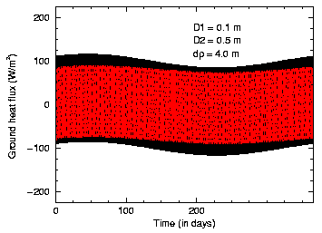  
**Figure 2:** Annual ground heat flux as estimated using the analytical solution (black) and LWL99 (red) using a damping depth of 4.0 m.

To study the difference on a daily time scale, Figure 3) and Figure 4) show days 70 to 76 for the same case that is shown in Figures 1), and 2 respectively. Figure 3) shows that the LWL99 formulation represents the daily cycle well, but it is positively biased due to the over-response to the annual cycle (Figure 1)).

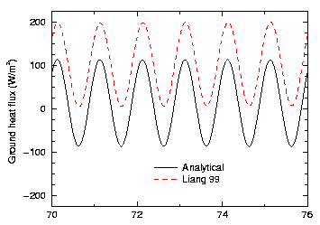  
**Figure 3:** Daily ground heat flux as estimated using the analytical solution (black) and LWL99 (red) using a damping depth of 0.132 m.

Figure 4) also shows good agreement between the LWL99 formulation and the analytical estimates of the daily heat flux cycle. However, unlike the comparison with the shallow damping depth (Figures 1) and 3), there is no heat flux bias.

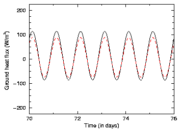  
**Figure 4:** Daily ground heat flux as estimated using the analytical solution (black) and LWL99 (red) using a damping depth of 4.0 m.

## IV. VIC Simulation Comparisons

This section compares VIC estimates of ground heat flux and surface temperature using the LWL99 formulation and the frozen soil finite difference method. Because the finite difference method explicitly solves the soil temperature profile at nodes through the soil column, it is assumed to represent more accurately the transport of thermal energy through the soil, than the LWL99 formulation which assumes an exponential soil temperature distribution.

All simulations for this study were conducted on three grid cells from the Arkansas - Red River basins. This basin was selected to minimize differences between the models caused by their handling of cold season processes. To further minimize the differences caused by cold season processes (the Arkansas-Red River basin does experience a small amount of snow and soil frost), ice content estimation (normally estimated using the method described by Cherkauer and Lettenmaier, 1999) was turned off, so it does not impact values for conduction, heat capacity, or the transport of soil moisture.

The three cells were selected to represent three levels of precipitation: wet (centered at latitude: 35.1875N, longitude: 93.5625W), dry (centered at latitude: 38.8125N, longitude: 103.4375W), and intermediate (centered at latitude: 38.4375N, longitude: 97.3125W). Simulations were started on 1/1/1980, and the comparison plots shown below all start on 1/1/1984 to minimize startup effects.

As in the analytical case studies, two scenarios were used, one with thin layers and a shallow damping depth, the other with thicker layers and a deep damping depth. Figures 5), 6, and 7 compare ground heat flux and surface temperature estimates for the three grid cells using the LWL99 formulation (black), and the finite difference method (red). For these simulations D1 = 0.10 m, D2 = 0.50 m, and dp = 4.0 m.

  
**Figure 5:** Weekly running average of hourly ground heat flux (left) and surface temperature (right) simulations using LWL99 (black) and the explicit method (red) for the wet grid cell. Damping depth for both simulations is 4.0 m. X-axis is in hours for one year.

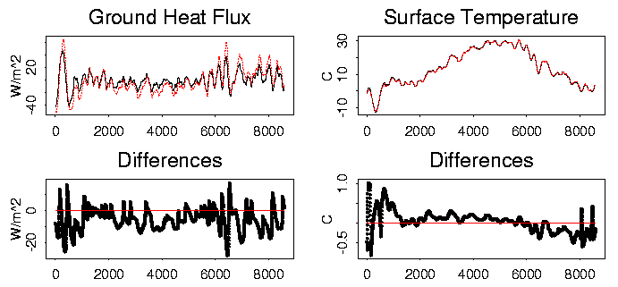  
**Figure 6:** Weekly running average of hourly ground heat flux (left) and surface temperature (right) simulations using LWL99 (black) and the explicit method (red) for the middle grid cell. Damping depth for both simulations is 4.0 m. X-axis is in hours for one year.

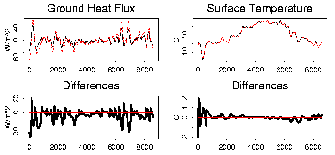  
**Figure 7:** Weekly running average of hourly ground heat flux (left) and surface temperature (right) simulations using LWL99 (black) and the explicit method (red) for the dry grid cell. Damping depth for both simulations is 4.0 m. X-axis is in hours for one year.

The wet grid cell (Figure 5)) shows the least difference between ground heat flux estimation methods, while it is greatest for the driest grid cell (Figure 7)). There is no clear bias, nor drift between the methods, though the variation in ground heat fluxes predicted by the LWL99 formulation is less than those predicted by the finite difference method. This observation agrees with a similar damping seen in the comparisons with the analytical data (Figures 2) and 4). Differences caused by the ground heat flux formulations are absorbed in the computation of the surface energy balance. Much of the difference is compensated for by changing the heat storage in the top soil layer. Thus wetter soils will experience less of an impact from the different heat flux formulations. The robustness of the surface energy balance can be seen in the very small differences that are actually seen in the computed surface temperature.

Figures 8), 9, and [0) were generated by solving the LWL99 formulation with D1 = 0.05 m, D2 = 0.10 m, and dp = 0.20 m. The finite difference method is still solved using the previously defined soil depth values.

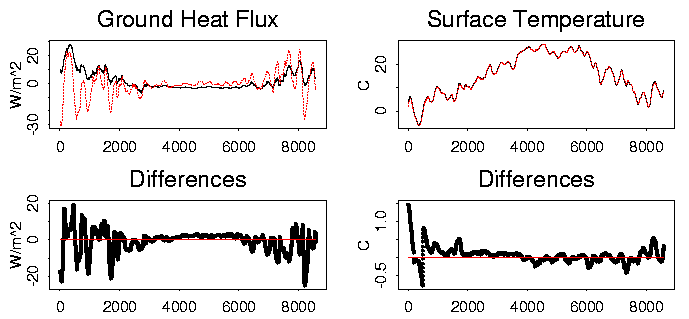  
**Figure 8:** Weekly running average of hourly ground heat flux (left) and surface temperature (right) simulations using LWL99 (black) and the explicit method (red) for the wet grid cell. Damping depth for the LWL99 simulation is 0.20 m. X-axis is in hours for one year.

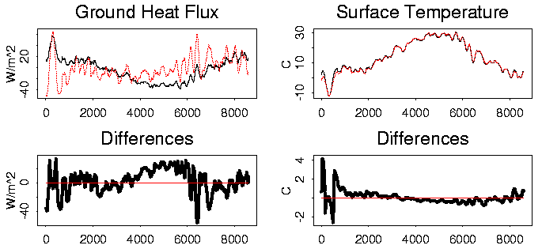  
**Figure 9:** Weekly running average of hourly ground heat flux (left) and surface temperature (right) simulations using LWL99 (black) and the explicit method (red) for the middle grid cell. Damping depth for the LWL99 simulation is 0.20 m. X-axis is in hours for one year.

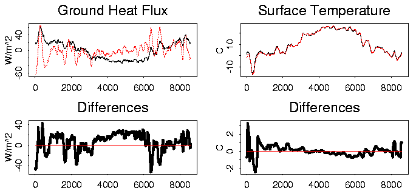  
**Figure 10:** Weekly running average of hourly ground heat flux (left) and surface temperature (right) simulations using LWL99 (black) and the explicit method (red) for the dry grid cell. Damping depth for the LWL99 simulation is 0.20 m. X-axis is in hours for one year.

All three cells show signs that the LWL99 formulation predicts more positive winter fluxes, and more negative summer fluxes than the finite difference scheme. Though somewhat harder to distinguish in the plots, there does appear to be a seasonal lag in the LWL99 formulation fluxes. These results are qualitatively consistent with the results in Section III.

## V. No-Flux Bottom Boundary

Both ground heat flux solution methods used in Section IV use a constant temperature bottom boundary condition to solve the heat flux equations. This means that the energy balance is not closed at the bottom of the soil column, so there will be a heat flux into or out of the bottom of the grid cell. To eliminate this exchange of energy at the bottom of the grid cell, the finite difference method can be modified to use a no-flux bottom boundary. This allows the temperature at the bottom of the soil column to change, while there is no heat flux across the bottom boundary.

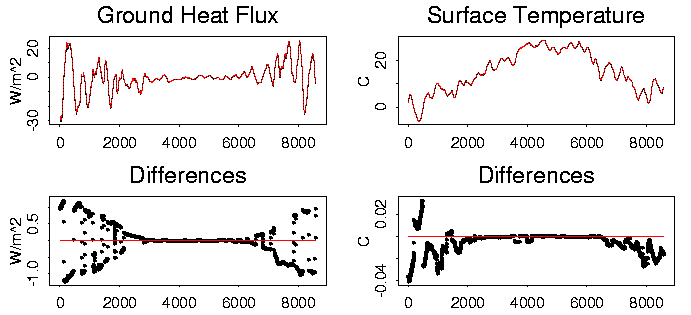  
**Figure 11:** Weekly running average of hourly ground heat flux (left) and surface temperature (right) simulations using the finite difference method with a constant temperature bottom boundary (black) and a no-flux bottom boundary (red) for the wet grid cell. Damping depth for both simulations is 4.0 m. X-axis is in hours for one year.

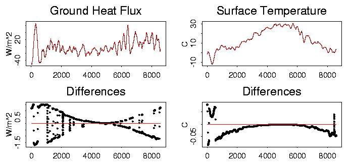  
**Figure 12:** Weekly running average of hourly ground heat flux (left) and surface temperature (right) simulations using the finite difference method with a constant temperature bottom boundary (black) and a no-flux bottom boundary (red) for the intermediate grid cell. Damping depth for both simulations is 4.0 m. X-axis is in hours for one year.

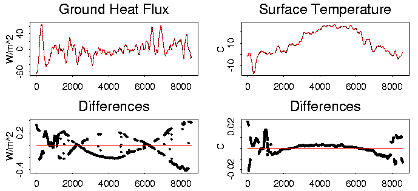  
**Figure 13:** Weekly running average of hourly ground heat flux (left) and surface temperature (right) simulations using the finite difference method with a constant temperature bottom boundary (black) and a no-flux bottom boundary (red) for the dry grid cell. Damping depth for both simulations is 4.0 m. X-axis is in hours for one year.

As can be seen from Figures 11), [2), and [3), there are no significant differences in either the estimated ground heat fluxes or surface temperatures between the models. Therefore it can be assumed that the thermal energy lost or gained through the bottom of the grid cell can be neglected for these simulations.

## VI. Discussion

In order to test and validate the performance of the LWL99 ground heat flux formulation, a series of comparisons were made. From these comparisons we draw the following conclusions:

*   The selection of damping depth is critically important for accurate estimation of ground heat fluxes, especially over multi-year time periods,
*   By using only the annual damping depth (or deeper) the LWL99 formulation compares favorably with the analytical solution,
*   Differences between the two VIC model ground heat flux solutions are dampened by the other surface energy balance components (especially heat storage in the top soil layer) resulting in only a small difference between estimated surface temperatures, and
*   Even though the constant temperature bottom boundary condition does not close the energy balance at the bottom of the soil column, there does not appear to be a significant long term impact on the surface energy balance.

Together these conclusions indicate that there is no compelling reason to believe that the LWL99 ground heat flux formulation is in any way detrimental to the estimation of the surface energy balance. However, in the next release of the VIC model code, users will be given the option of running with the finite difference solution.

## VII. References

Cherkauer, K., Simulating the effects of frozen soil in a large scale hydrologic model, _UW/UBC Conference_, October 3, 1997.

Cherkauer, K. A. and D. P. Lettenmaier, Hydrologic effects of frozen soils in the upper Mississippi River basin, _J. Geophys. Res._, **104**(D16), 19,599-19,610, 1999.

Deardorff, J. W., Efficient prediction of ground surface temperature and moisture, with inclusion of a layer of vegetation, _J. Geophys. Res._, **83**(C4), 1889-1903, 1978

Flerchinger, G. N., and K. E. Saxton, Simultaneous heat and water balance model of a freezing snow-residue-soil system: I. Theory and development, _Trans. ASCE_, **32**(2), 573-578, 1989.

Liang, X., E. F. Wood, and D. P. Lettenmaier, Modeling ground heat flux in land surface parameterization schemes, _J. Geophys. Res._, **104**(D8), 9581-9600, 1999.

Lohmann, D., Comment on the paper: Modeling ground heat flux in land surface parameterization schemes, by Liang, Wood, Lettenmaier (1999), submitted _J. Geophys. Res._, 2000.

Maurer, E., D. P. Lettenmaier, and J. Roads, Water balance of the Mississippi River basin from a macroscale hydrologic model and NCEP/NCAR reanalysis, AGU Fall Meeting, December 16, 1999.

Rhoads, J. D., Validation of land surface models using satellite derived surface temperatures, Masters Thesis, Univ. of Maryland, 47 pp., College Park, Md., 1999.
