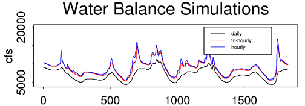
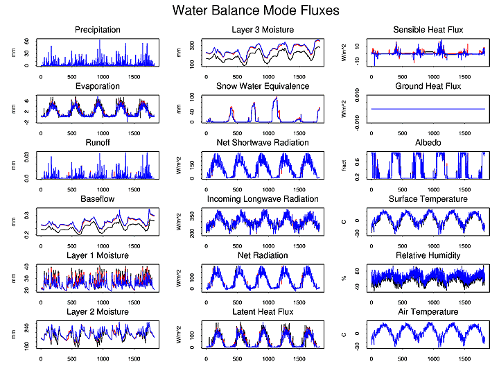
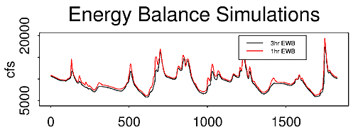
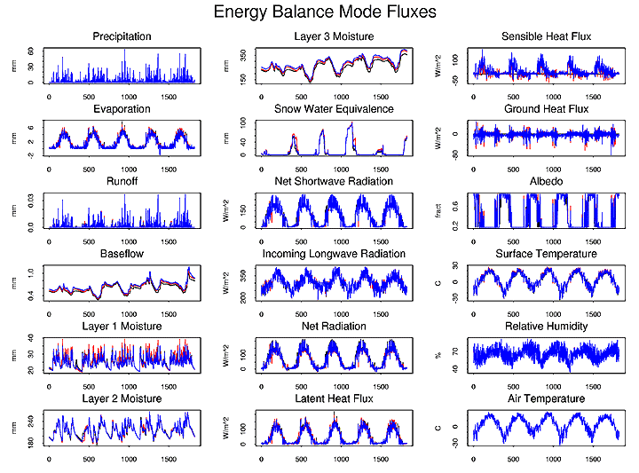
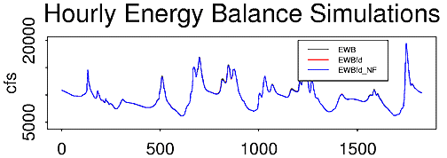
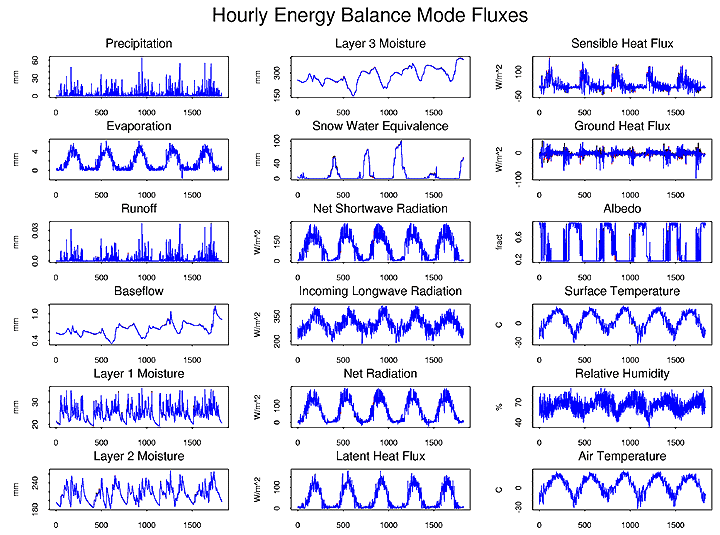
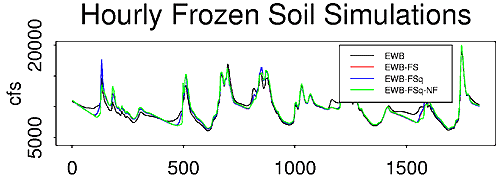
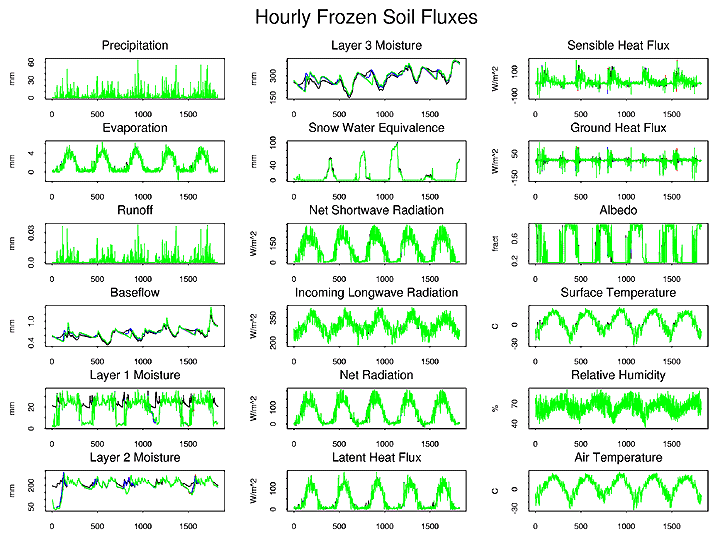

# Notes on the various modes of the VIC model

Prepared by Keith Aric Cherkauer

This page discusses differences between the simulation modes introduced in VIC release 4.0.0\. Some of these modes are accessed simply by changing the options in the [global parameter file](../GlobalParam.md), while others required that pre-processor options are defined prior to compiling the model. Also provided in this note is information about how the model simulations differ due to the selected time step.

* * *

## Water Balance
```
Model Control File Options
FULL_ENERGY	FALSE
FROZEN_SOIL	FALSE
GRND_FLUX	FALSE
```
The water balance model does not solve the surface energy balance. Instead it assumes that the soil surface temperature is equal to the air temperature for the current time step. The exception to this is that the snow algorithm still solves the surface energy balance to determine the fluxes needed to drive accumulation and ablation processes. By eliminating the ground heat flux solution and the iterative processes required to close the surface energy balance, the water balance model requires significantly less computational time than other model modes (Table I).

It should be noted that the daily water balance model while significantly faster than sub-daily simulations is essentially a different model. The parameterizations required for daily solutions are different from those used for sub-daily solutions. While the daily water balance model can be used to simulate discharge from a basin it should be understood that calibration parameters for the daily water balance model are unlikely to be transferable to any model run with a sub-daily time step.

Figure 1 compares the simulated discharge from daily, hourly and three-hourly simulations of the Chippewa River using the VIC model in water balance mode. It is clearly visible that the daily water balance model solution is very different from that of either of the sub-daily simulations. Water and energy fluxes for a single grid cell and all three simulation modes are shown in Figure 2. Here it is clear that the daily water balance model experiences higher evaporation, resulting in lower soil moistures and lower baseflows. This is directly responsible for the differences in discharge seen in Figure 1.

  
**Figure 1.** discharge from the Chippewa River basin for various water balance mode simulations.

  
**Figure 2.** grid cell energy and water balance fluxes for various water balance mode simulations.

* * *

## Energy Balance
```
Model Control File Options
FULL_ENERGY	TRUE
FROZEN_SOIL	FALSE
GRND_FLUX	TRUE
```
Energy balance mode solves the complete water balance but also minimizes the surface energy balance error. The surface energy balance is closed through an iterative process which tries finds a surface temperature which adjusts surface energy fluxes (sensible heat, ground heat, ground heat storage, outgoing longwave and indirectly latent heat) so that they compensate for incoming solar and longwave radiation fluxes. This mode requires more computational time than water balance mode as well as requiring a sub-daily simulation time step. However, it simulates the surface energy fluxes, which are important to understanding the hydrologic cycle and land surface-atmosphere interactions in a basin.

Figure 3 compares the simulated discharge from hourly and three hourly energy balance simulations versus the hourly water balance discharge from Figure 1. All three modes yield very similar results. Looking at individual fluxes at a grid cell, Figure 4 shows that moisture fluxes from the energy balance mode simulations are similar with those from the water balance mode simulation. It also shows that the with energy balance mode activated all of the components of the surface energy balance are simulated.

  
**Figure 3.** discharge from the Chippewa River basin for various energy balance mode time steps.

  
**Figure 4.** grid cell energy and water balance fluxes for various energy balance mode time steps.

### Quick Flux

```
Model Control File Options
QUICK_FLUX	TRUE
```

The default setting for the energy balance model is to use a simplified method for estimating the ground heat flux. Described in detail by _Liang, Wood and Lettenmaier_ ([1999](../References.md)) this method estimates ground heat flux by assuming an exponential temperature profile between a near surface thermal node (5 to 15 cm deep) and the thermal damping depth (at which depth soil temperature is unaffected by daily and annual changes in surface temperature. The solution uses a constant soil temperature at the damping depth.

### Finite Difference

```
Model Control File Options
QUICK_FLUX	FALSE
NOFLUX	FALSE
```

The finite difference heat flux solution was developed for the frozen soil algorithm and is describe in detail by _Cherkauer and Lettenmaier_ ([1999](../References.md)). The finite difference method makes no assumptions about the temperature profile, instead it solves heat fluxes at nodes through the soil column using a finite difference solution to the heat flux equations. Soil nodes at set at the surface, between the first and second soil layers, at twice the depth of the second node, and at the thermal damping depth. Other nodes are either spaced equally between the third node and the damping depth, or at user defined depths in the same space. The solution uses a constant soil temperature at the damping depth.

Differences in discharge between the hourly energy balance mode with the quick ground heat flux and the finite difference ground heat flux are shown in Figure 5. The finite difference code takes slightly longer to run (Table I) but yields similar discharge results. Larger differences can can seen in the simulated ground heat flux and sensible heat flux shown in Figure 6. The technical note on ground heat flux calculations indicates that the finite difference method may provide a more accurate solution of ground heat flux but that in most cases the differences have a minimal effect on the components of the water balance. Therefore the method selected for computing ground heat flux is primarily an issue of computation time.

  
**Figure 5.** discharge from the Chippewa River basin for various hourly energy balance mode simulations.

  
**Figure 6.** grid cell energy and water balance fluxes for various hourly energy balance mode simulations.

#### No Flux Boundary

```
Model Control File Options
QUICK_FLUX	FALSE
NOFLUX	TRUE
```

When the no flux boundary is selected the VIC model solves ground heat flux using the finite difference method. However, instead of using a constant temperature boundary at the damping depth, the model uses a no flux boundary. This means that the soil temperature at the damping depth can change, but there is no loss or gain of heat energy through the boundary. This method adds slightly to the computation time (Table I) but is especially useful for very long simulations, climate change studies and permafrost simulations.

Discharge and flux estimates for the hourly energy balance model with a no flux bottom boundary are included in Figures 5 and 6 respectively.

* * *

## Frozen Soil
```
Model Control File Options
FULL_ENERGY	TRUE
FROZEN_SOIL	TRUE
GRND_FLUX	TRUE
NOFLUX	FALSE
```

Frozen soil adds the effects of soil ice content to both moisture and energy fluxes. It solve thermal fluxes at nodes through the soil column using the [finite difference](#finitedifference) method previous described. In addition it computes the maximum unfrozen water content at each soil node based on the nodal temperature. Ice content for each soil moisture layer is then computed from the nodal values and is used to restrict infiltration and soil moisture drainage. The nodal ice contents are also used to derive the soil thermal conductivity and volumetric heat capacity for the next model time step.

The frozen soil algorithm is computationally intensive (Table I) but may play a major role in both the energy and water balance of cold regions (through seasonally frozen soil and permafrost). For details about the frozen soil see _Cherkauer and Lettenmaier_ ([1999](../References.md)).

Figure 7 compares simulated discharge using hourly energy balance mode and hourly energy balance mode (**1hr EWB**) with frozen soil (**1hr EWB FS**). The frozen soil algorithm increases peak flows in the spring and decreases baseflow in the winters. A comparison of the fluxes for a grid cell in the same basin is shown in Figure 8.


**Figure 7.** discharge from the Chippewa River basin for various hourly energy balance with frozen soil algorithm mode simulations.


**Figure 8.** grid cell energy and water balance fluxes for various hourly energy balance with frozen soil algorithm mode simulations.

### Quick Frozen Soil

```
Model Control File
Options FULL_ENERGY	TRUE
FROZEN_SOIL	TRUE
GRND_FLUX	TRUE
NOFLUX	FALSE
Model Pre-processor Options
QUICK_FS	TRUE
QUICK_FS_TEMPS	Ntemp
```

The time required to solve the frozen soil algorithm can be reduced significantly by compiling the VIC model the the QUICK_FS pre-processor option activated. This creates a set of `Ntemp` linear equations which represent the more complex maximum unfrozen water (UFWC) equation. The new set of equations reduces the accuracy of the solution of the UFWC equation but by removing the complex power function, which is solved often for each iteration, it saves a lot of computational time (Table I).

Differences between the hourly frozen soil algorithm with (1hr EWB FSq) and without (1hr EWB FS) the linearized UFWC equation are plotted in Figures 7 and 8.

### No Flux Boundary

```
Model Control File Options
FULL_ENERGY	TRUE
FROZEN_SOIL	TRUE
GRND_FLUX	TRUE
NOFLUX	TRUE
```
The finite difference ground heat flux solution used with the frozen soil algorithm can, like that for the energy balance, be solved using a [no flux bottom boundary condition](#no-flux-boundary). Plots of discharge and cell fluxes of the hourly energy balance with frozen soil and no bottom flux (1hr EWB FSq NF) can be found in Figures 7 and 8 respectively.

* * *

## Special Cases

The following model modes are special cases which can be applied to any of the above modes but modify them in the described fashion. These options were controlled by pre-processor commands in user_def.h and need to be set before the source code is compiled.

### Low Resolution Moisture
```LOW_RES_MOIST   TRUE```

This mode changes how the VIC model computes soil moisture drainage. In the original model drainage is a straight function of the unsaturated hydraulic conductivity (_[Liang et al. 1994](../References.md)_). However, _Boone and Wetzel_ ([1996](#references)) showed that when this method is used with a small number of soil layers (2-4) it drains the soil too quickly. They proposed a different method which uses the average soil matric potential of the current layer and the one below it to find a better value for the unsaturated hydraulic conductivity. They showed that soil moisture storage simulated using this new method compared favorably to a model with many soil moisture layers, allowing the model with fewer layers to retain more soil moisture near the top of the soil column. With LOW_RES_MOIST activated teh VIC model uses the Boone and Wetzel method to compute soil layer drainage.

### Optimize Output
```OPTIMIZE  TRUE```

This modifies the model so that it outputs daily runoff and baseflow only. This reduces simulation time slightly (Table I) but can significantly reduce post-processing time for sub-daily model simulations. This mode was designed for use with the model optimization code though it may also be of use for calibration by hand since it eliminates some post-processing steps.

### Model State
```SAVE_STATE   TRUE```

When SAVE_STATE is active and the STATE file variables have been set in the [global parameter file](../GlobalParam.md), VIC will create a state file at hour 0 of the selected day. Subsequently the VIC model can be restarted at the start of that day using the same state file (INIT_STATE option in the [global parameter file](../GlobalParam.md)). Users can also create their own [state file](../StateFile.md) to start the VIC model with observed properties (_i.e._ for a field site simulation).

### Debug Code
```LINK_DEBUG   TRUE```

The LINK_DEBUG option allows the user to access various pre-defined debugging output files (see [Define Debugging Parameters](../GlobalParam.md#DefineDebuggingParameters) in the [global parameter file](../GlobalParam.md)). Activating the debugging code significantly increases computation time since it adds multiple conditional statements, therefore its use is not recommended unless you are actively working with the code.

* * *

## Simulation Time

Though the core model for version 4.0.0 is faster than that released with version 3.2.1, the simulation times listed in [**Table I**](#tablei) show that version 3.2.1 is typically the faster model. This is due primarily to the MTCLIM routine which was added to release 4.0.0 to improve the estimation of incoming radiative fluxes, and atmospheric vapor pressure. Though it does a better job than the previous estimation routines, MTCLIM does require more time to prepare the forcings for each grid cell.

If simulation time is more important than conserving disk space (_e.g._ for calibration which requires many runs over short simulation periods) the sub-daily forcings estimated by MTCLIM can be extracted from the VIC model. By driving VIC directly with the estimated values, it does not have to run MTCLIM so simulation times should be significantly reduced.

Table I: Simulation times for various VIC model modes.

| SIMULATION       	| VERBOSE 	| OPTIMIZE 	| LDAS_OUTPUT 	| QUICK_FS 	| LOW_RES_MOIST 	| time 3.2.1 [sec] 	| time 4.0.0 [sec] 	|
|------------------	|---------	|----------	|-------------	|----------	|---------------	|------------------	|------------------	|
| 24hr_WB          	| TRUE    	| FALSE    	| TRUE        	| FALSE    	| FALSE         	| N/A              	| 51.85            	|
| 24hr_WB_LRM      	| TRUE    	| FALSE    	| TRUE        	| FALSE    	| TRUE          	| N/A              	| 79.39            	|
| 24hr_WB_OPTI     	| FALSE   	| TRUE     	| TRUE        	| FALSE    	| FALSE         	| N/A              	| 52.38            	|
| 1hr_WB           	| TRUE    	| FALSE    	| TRUE        	| FALSE    	| FALSE         	| N/A              	| 133.23           	|
| 1hr_WB_LRM       	| TRUE    	| FALSE    	| TRUE        	| FALSE    	| TRUE          	| N/A              	| 165.99           	|
| 1hr_WB_OPTI      	| FALSE   	| TRUE     	| TRUE        	| FALSE    	| FALSE         	| N/A              	| 119.16           	|
| 3hr_WB           	| TRUE    	| FALSE    	| TRUE        	| FALSE    	| FALSE         	| N/A              	| 58.99            	|
| 1hr_EWB          	| TRUE    	| FALSE    	| TRUE        	| FALSE    	| FALSE         	| N/A              	| 361.19           	|
| 1hr_EWB_LRM      	| TRUE    	| FALSE    	| TRUE        	| FALSE    	| TRUE          	| N/A              	| 411.64           	|
| 1hr_EWB_OPTI     	| FALSE   	| TRUE     	| TRUE        	| FALSE    	| FALSE         	| N/A              	| 348.28           	|
| 1hr_EWBfd        	| TRUE    	| FALSE    	| TRUE        	| FALSE    	| FALSE         	| N/A              	| 417.02           	|
| 1hr_EWBfd_NF     	| TRUE    	| FALSE    	| TRUE        	| FALSE    	| FALSE         	| N/A              	| 438.21           	|
| 3hr_EWB          	| TRUE    	| FALSE    	| TRUE        	| FALSE    	| FALSE         	| N/A              	| 142.14           	|
| 1hr_EWB-FS       	| TRUE    	| FALSE    	| TRUE        	| FALSE    	| FALSE         	| N/A              	| 937.43           	|
| 1hr_EWB-FSq      	| TRUE    	| FALSE    	| TRUE        	| TRUE     	| FALSE         	| N/A              	| 639.74           	|
| 1hr_EWB-FSq_LRM  	| TRUE    	| FALSE    	| TRUE        	| TRUE     	| TRUE          	| N/A              	| 705.08           	|
| 1hr_EWB-FSq_NF   	| TRUE    	| FALSE    	| TRUE        	| TRUE     	| FALSE         	| N/A              	| 664.82           	|
| 1hr_EWB-FSq_OPTI 	| FALSE   	| TRUE     	| TRUE        	| TRUE     	| FALSE         	| N/A              	| 628.14           	|
| 3hr_EWB-FS       	| TRUE    	| FALSE    	| TRUE        	| FALSE    	| FALSE         	| N/A              	| 357.2            	|
| 3hr_EWB-FSq      	| TRUE    	| FALSE    	| TRUE        	| TRUE     	| FALSE         	| N/A              	| 245.54           	|

| Time Step       	|                                                      	|
|-----------------	|------------------------------------------------------	|
| 24hr            	| daily time step                                      	|
| 3hr             	| three hourly time step                               	|
| 1hr             	| hourly time step                                     	|

| Simulation Mode 	|                                                      	|
|-----------------	|------------------------------------------------------	|
| WB              	| water balance                                        	|
| EWB             	| energy balance                                       	|
| EWBfd           	| energy balance w/ finite difference ground heat flux 	|
| EWB-FS          	| frozen soil active                                   	|
| EWB-FSq         	| quick frozen soil active                             	|

| Special Case    	|                                                      	|
|-----------------	|------------------------------------------------------	|
| OPTI            	| optimized code                                       	|
| LRM             	| low resolution moisture                              	|
| NF              	| no flux bottom boundary                              	|


*Note*: Simulations for Table I were conducted in the Chippewa River basin. The basin consists of five one-degree grid cells in the north central region of the upper Mississippi River basin. Cells have a total of 29 vegetation tiles (5, 4, 7, 6, and 7 tiles, respectively) and the simulation is run from January 1, 1980 to December 31, 1985\. Simulations were run on a 450 MHz Pentium II running freeBSD.

File compression was not used for these simulations. File compression makes calls to gzip to compress and uncompress files. This conserves disk space but slows down simulations.

* * *

## References

Boone, A and P. J. Wetzel, Issues related to low resolution modeling of soil moisture: experience with the PLACE model, _Global and Planetary Change_, **13**, p. 161-181, 1996.
