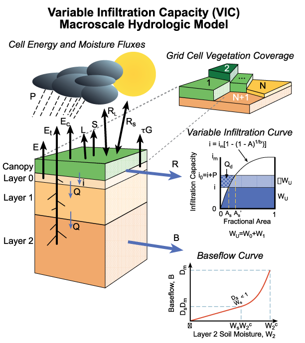
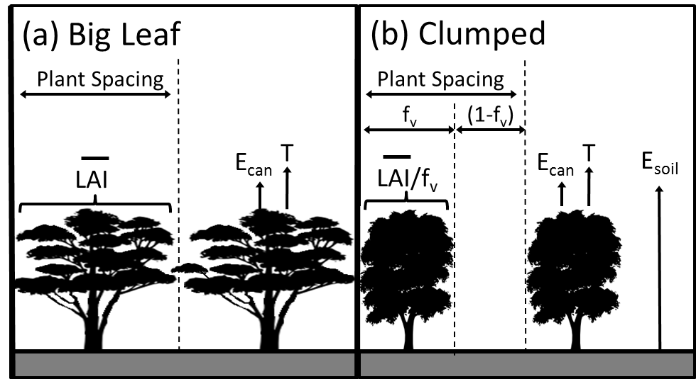
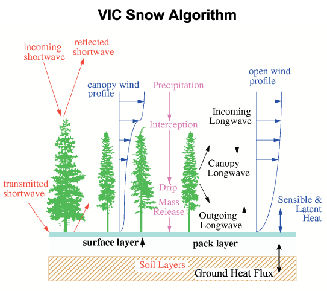
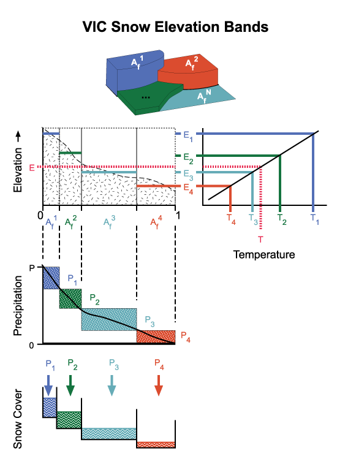
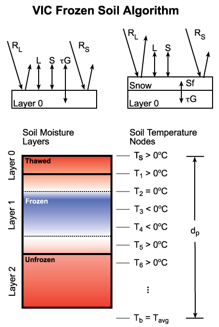
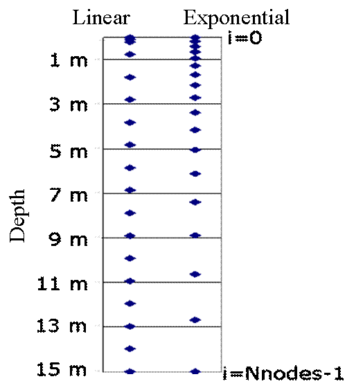
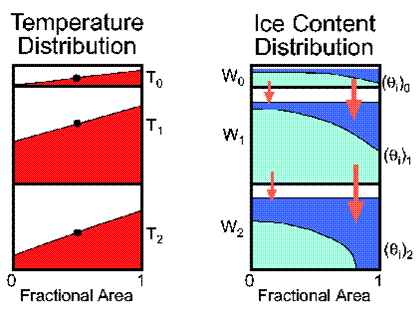
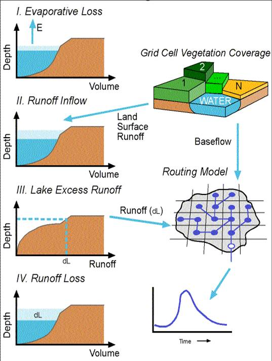
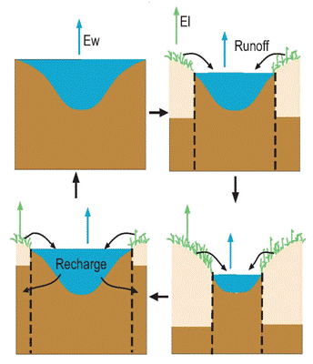

# VIC Model Overview

!!! note
    You are viewing the documentation for VIC version 5 (VIC-5). Relative to VIC-4, this version includes many infrastructure improvements. Those enhancements are described in [Hamman et al, 2018](https://doi.org/10.5194/gmd-11-3481-2018).

## Main Features

The VIC model ([Liang et al., 1994](../Documentation/References.md#primary-historical-reference)) is a large-scale, semi-distributed hydrologic model.  As such, it shares several basic features with the other land surface models (LSMs) that are commonly coupled to global circulation models (GCMs):

1. The land surface is modeled as a grid of large (>>1km), flat, uniform cells
    - Sub-grid heterogeneity (e.g. elevation, land cover) is handled via statistical distributions
1. Inputs are time series of sub-daily meteorological drivers (e.g. precipitation, air temperature, wind speed, radiation, etc.)
1. Land-atmosphere fluxes, and the water and energy balances at the land surface, are simulated at a daily or sub-daily time step
1. Water can only enter a grid cell via the atmosphere
    - Non-channel flow between grid cells is ignored
        -  The portions of surface and subsurface runoff that reach the local channel network within a grid cell are assumed to be >> the portions that cross grid cell boundaries into neighboring cells
    - Once water reaches the channel network, it is assumed to stay in the channel (it cannot flow back into the soil)

This last point has several consequences for VIC model implementation:

1. Grid cells are simulated independently of each other, there is no communication between grid cells
2. Routing of stream flow is performed separately from the land surface simulation, using a separate model (typically the routing model of [Lohmann et al., 1996 and 1998](../Documentation/References.md#streamflow-routing-model-references))

## Land Cover and Soil

Figure 1.  VIC land cover tiles and soil column, with major water and energy fluxes.

### Land Cover

- can subdivide each grid cell's land cover into arbitrary number of "tiles", each corresponding to the fraction of the cell covered by that particular land cover (e.g. coniferous evergreen forest, grassland, etc.) (Figure 1).
- geographic locations or configurations of land cover types are not considered; VIC lumps all patches of same cover type into 1 tile.
- one landcover tile per cell can contain a lake/wetland basin.
- fluxes and storages from the tiles are averaged together (weighted by area fraction) to give grid-cell average for writing to output files.
- for a given tile, jarvis-style veg stomatal response used in computing transpiration.
- considers canopy energy balance separately from ground surface.
- accounts for soil evaporation and different wind and radiation attenuation in spaces between individual plants (or gaps in the canopy); vegetated and non-vegetated area fractions are controlled by vegetated area fraction (fv) (Figure 2).  See [Bohn and Vivoni (2016)](../Documentation/References.md#other-historical-references) for more details.
- supports optional input of daily timeseries of LAI, albedo, and vegetated area fraction from forcing files instead of using the monthly climatology specified in the veg library or veg parameter files.  See [Bohn and Vivoni (2016)](../Documentation/References.md#other-historical-references)for more details.

Figure 2. Schematic of the big leaf (pre-VIC 4.2) and clumped (4.2 and later) vegetation schemes. The spatial average leaf area index (LAI) within a given vegetation tile is assumed uniformly distributed in the big leaf scheme, but is rescaled by the vegetated area fraction (fv) to estimate a plant-specific LAI in the clumped scheme. Transpiration (T) and evaporation of canopy interception (Ecan) is complemented by soil evaporation (Esoil) in the clumped scheme.

- computes potential evapotranspiration as the area-weighted sum of potential transpiration and potential soil evaporation.  Potential transpiration is computed for the current vegetation, using its current architectural resistance and LAI to compute canopy resistance in the absence of limitation from soil moisture, vapor pressure deficit, temperature, or insolation.

### Soil

- arbitrary number of soil layers, but typically 3 (Figure 1)
- infiltration into the top-most layers controlled by variable infiltration capacity (VIC) parameterization [(Liang et al., 1994)](../Documentation/References.md#primary-historical-reference)
- layers within the root zone can lose moisture to evapotranspiration
- top-most layers can lose moisture to soil evapotranspiration via ARNO formulation ([Francini and Pacciani, 1991](../Documentation/References.md#other-references))
- gravity-driven flow from upper layers to lower layers (Brooks and Corey, 1964)
- ARNO baseflow formulation for drainage from bottom layer ([Francini and Pacciani, 1991](../Documentation/References.md#other-references))
- each land cover tile has its own soil temperature profile
- simulation of frozen soil ([Cherkauer and Lettenmaier, 1999](../Documentation/References.md#other-historical-references))
- Simulates soil temperature spatial heterogeneity within a land cover tile ([Cherkauer et al., 2003](../Documentation/References.md#other-historical-references))
- simulates permafrost-specific processes such as melting of excess ground ice ([Adam and Lettenmaier, 2008](../Documentation/References.md#other-historical-references))
- computes the water table depth as a function of soil moisture and soil texture, as described in [Bohn et al. (2013b)](../Documentation/References.md#other-historical-references).
- accounts for the thermal properties of organic soil, as described in [Farouki (1981)](../Documentation/References.md#other-references).

## Snow Model

VIC considers snow in several forms: ground snow pack, snow in the vegetation canopy, and snow on top of lake ice (Figure 3). The VIC snow model has the following main features:

- ground snow pack is quasi 2-layer; the topmost portion of the pack is considered separately for solving energy balance at pack surface ([Andreadis et al., 2009](../Documentation/References.md#other-historical-references))
- considers partial snow coverage
- considers blowing snow sublimation ([Bowling et al, 2004](../Documentation/References.md#other-historical-references))

For more information about the snow pack formulation, [click here](SnowModelText.md).

Figure 3.  VIC snow model.

## Meteorology

### Meteorological Input Data

VIC requires the following meteorological forcing variables.

- Precipitation
- Air temperature
- Wind speed
- Longwave radiation
- Shortwave radiation
- Atmospheric pressure
- Vapor pressure

These forcings must be provided at the timestep that the model will be run at (e.g. `SNOW_STEPS_PER_DAY` or `MODEL_STEPS_PER_DAY`). Traditionally, VIC users have used the MTCLIM package to generate and disaggregate forcings variables. See [Bohn et al., 2013a](../Documentation/References.md#other-historical-references) for more information on how this has been done in the past.

### Non-Meteorological Input Data

VIC can read daily timeseries of land cover information such as albedo, LAI, and vegetation canopy cover fraction as forcing variables ([Bohn and Vivoni, 2016](../Documentation/References.md#other-historical-references)).

### Elevation Bands

VIC can consider spatial heterogeneity in precipitation, arising from either storm fronts/local convection or topographic heterogeneity.  Here we consider the influence of topography, via elevation bands (Figure 4).  This is primarily used to produce more accurate estimates of mountain snow pack.  This functionality is controlled by the `SNOW_BAND` option in the *global parameter file*.  Main features:

- Can subdivide the grid cell into arbitrary number of elevation bands, to account for variation of topography within cell
- Within each band, meteorologic forcings are lapsed from grid cell average elevation to band's elevation
- Geographic locations or configurations of elevation bands are not considered; VIC lumps all areas of same elevation range into 1 band
- Fluxes and storages from the bands are averaged together (weighted by area fraction) to give grid-cell average for writing to output files
- However, the band-specific values of some variables can be written separately in the output files

For more information about the snow/elevation band formulation, [click here](SnowBandsText.md).

Figure 4.  VIC snow (elevation) bands.

## Frozen Soil Formulation

### Soil Thermal Solution

VIC can use either the approximate soil temperature profile of [Liang et al. (1999)](../Documentation/References.md#other-historical-references) or a finite difference solution that takes soil ice content into account, described in [Cherkauer and Lettenmaier (1999)](../Documentation/References.md#other-historical-references). (Figure 5)

- Liang et al. (1999): set `QUICK_FLUX = TRUE` in *global parameter file*; this is the default for `FULL_ENERGY = TRUE` and `FROZEN_SOIL = FALSE`.
- Cherkauer et al. (1999): set `QUICK_FLUX = FALSE` in *global parameter file*; this is the default for `FROZEN_SOIL = TRUE`.
    - By default, the finite difference formulation uses implicit scheme.
    - By default, the nodes of the finite difference formulation are distributed exponentially.

For more information about the frozen soil formulation, [click here](FrozenSoilText.md).

Figure 5.  VIC frozen soil formulation.

### Permafrost

These apply to the case QUICK_FLUX = FALSE and FROZEN_SOIL = TRUE, i.e. the formulation of [Cherkauer and Lettenmaier (1999)](../Documentation/References.md#other-historical-references).

- global parameter file option: `IMPLICIT`: uses an implicit scheme to solve the soil thermal profile. This is the default scheme.
- global parameter file option: `EXP_TRANS`: uses exponential node spacing (dense node spacing near soil surface; sparse node spacing at depth) (Figure 6)

Figure 6.  VIC permafrost enhancements.

### Temperature Heterogeneity: "Spatial Frost"

- Details described in [Cherkauer et al., 2003](../Documentation/References.md#other-historical-references)
- Linear (uniform) distribution of soil temperature around a mean (Figure 7)
- Allows some moisture movement in soil when the average temperature is below freezing

Figure 7.  VIC spatial frost formulation.

## Dynamic Lake/Wetland Model

The lake/wetland model ([Bowling and Lettenmaier, 2010](../Documentation/References.md#other-historical-references)) handles the impoundment of surface water within a grid cell.  Each grid cell is allowed to have a lake/wetland system contained within one of its landcover tiles.  Here, a **_lake_** refers to any impounded surface water, including permanent lakes and seasonal flooding of vegetated land.  The lake's area can vary with time as a function of storage and topography (bathymetry).  In this context, **_wetland_** refers to the exposed portion of the landcover tile.

### Lake Model

- Multi-layer lake model (Figure 8), based on the model of [Hostetler and Bartlein (1990)](../Documentation/References.md#other-references), [Hostetler (1991)](../Documentation/References.md#other-references), and [Hostetler et al (2000)](../Documentation/References.md#other-references)
- Energy balance model
- Mixing, radiation attenuation, variable ice cover
- Dynamic lake area as a function of storage
    - This relationship must be specified as an input parameter
    - For the case of a grid cell containing only one lake, the storage-area relationship == lake bathymetry (plus nearby topography)
    - For multiple lakes within one grid cell, the model considers a single, composite lake; storage-area relationship in this case != lake bathymetry (algorithms for this are under development)
- Lakes can be linked directly to channel network. Lakes can receive inflows from both a) runoff from the surrounding upland within the same grid cell and b) channel flows from upstream grid cells (see [Gao et al., 2011](../Documentation/References.md#selected-application-references) for an example application).
- Lakes drain directly into the channel network. Lake outflows consist of:
    - channel flow (modeled as flow over a broad-crested weir)
        subsurface flow (which will flow into the wetland if the wetland is dry)
- To run the lake model, user must set `LAKES` to the name of a suitable lake parameter file in the global parameter file. Cells that do not contain lakes can be denoted within the lake parameter file.
- To turn the lake model off completely, the user must either set `LAKES` to `FALSE` or omit any mention of `LAKES` in the global parameter file.

Figure 8.  VIC lake model formulation.

### Wetland Model

- Lakes and wetlands exist in their own "tile" within the grid cell (Figure 9)
- Dynamic wetland area = tile area - dynamic lake area
- Allows seasonal inundation of wetlands as lake grows and shrinks
- Wetland moisture/energy flux computations are similar to those of upland tiles
- Wetland soils will tend to be wetter than upland soils due to frequent inundation and recharge by lake

Figure 9.  VIC dynamic lake/wetland interaction.

## Carbon Cycle Processes

- VIC optionally simulates photosynthesis, autotrophic respiration, and heterotrophic respiration, as described in [Bohn et al. (2013b)](../Documentation/References.md#other-historical-references)
- Plant phenology is NOT dynamic. Vegetative biomass is not simulated. LAI and other vegetation characteristics are prescribed in the same way as when carbon cycling is turned off.
- There are three soil carbon reservoirs: litter (residence time of 2.86 years), intermediate (residence time of 33.3 years), and slow (residence time of 1000 years).
- The previous year's total net primary productivity (NPP; photosynthesis minus autotrophic respiration) is added to the litter pool during the current year, with a constant flux equal to 1/365 * (previous year's total NPP).
- Respiration from the three soil carbon pools is proportional to (the amount of carbon stored in the pool) * exp(-residence time) * (Lloyd-Taylor temperature dependence) * (function of soil moisture).
- A constant fraction of respiration from each pool enters the atmosphere as CO2. For the litter pool, the remainder of respired carbon is sent to the intermediate and slow pools. For the intermediate pool, the remainder is sent to the slow pool. For the slow pool, all respired carbon is sent to the atmosphere.

## Streamflow Routing

Routing of stream flow is performed separately from the land surface simulation, using a separate model, typically the routing model of [Lohmann, et al. (1996; 1998)](../Documentation/References.md#streamflow-routing-model-references). The original Lohmann routing model is no longer supported but remains available [here](https://github.com/UW-Hydro/VIC_Routing). An updated version of the model, RVIC, is available [here](http://rvic.readthedocs.org).
